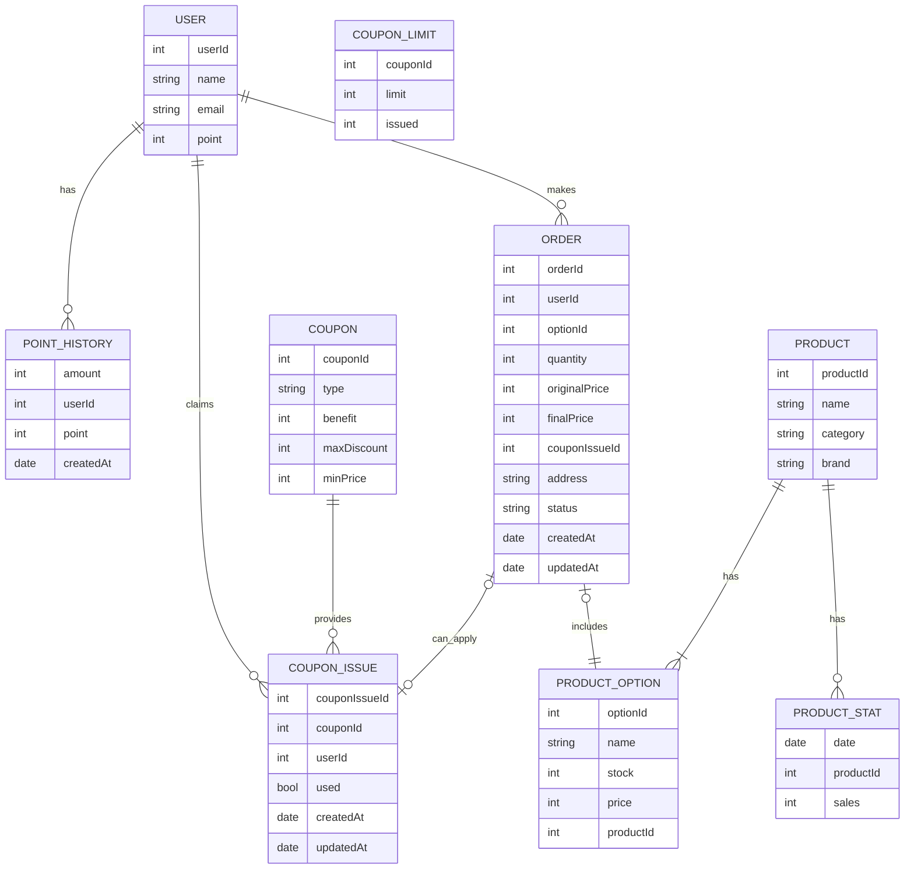

```mermaid
erDiagram

USER ||--o{ POINT_HISTORY: has
USER ||--o{ COUPON_ISSUE: claims
USER ||--o{ ORDER: makes
PRODUCT ||--o{ PRODUCT_STAT: has
ORDER |o--||PRODUCT_OPTION: includes
PRODUCT ||--|{ PRODUCT_OPTION: has
COUPON ||--o{ COUPON_ISSUE: provides
ORDER |o--o| COUPON_ISSUE: can_apply

USER {
    int userId
    string name
    string email
    int point
}

POINT_HISTORY {
    int amount
    int userId
    int point
    date createdAt
}

PRODUCT {
    int productId
    string name
    string category
    string brand
}

PRODUCT_STAT {
    date date
    int productId
    int sales
}

PRODUCT_OPTION {
    int optionId
    string name
    int stock
    int price
    int productId
}

COUPON {
    int couponId
    string type
    int benefit
    int maxDiscount
    int minPrice
}

COUPON_ISSUE {
    int couponIssueId
    int couponId
    int userId
    bool used
    date createdAt
    date updatedAt
}

COUPON_LIMIT {
    int couponId
    int limit
    int issued
}

ORDER {
    int orderId
    int userId
    int optionId
    int quantity
    int originalPrice
    int finalPrice
    int couponIssueId
    string address
    string status
    date createdAt
    date updatedAt
}
```
