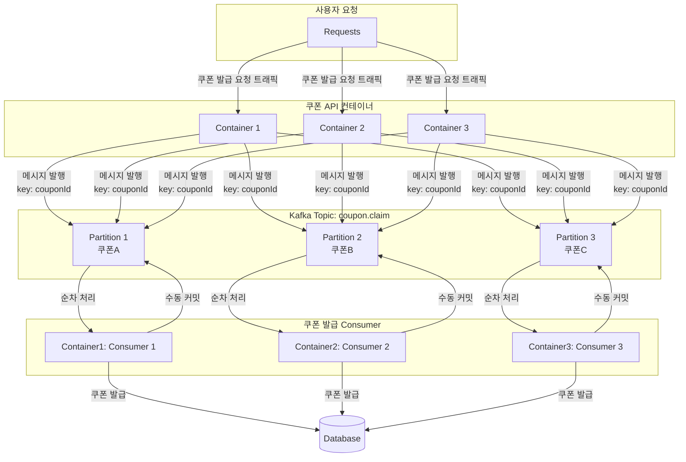

# 카프카로 대용량 트래픽 프로세스의 순차성 확보 및 부하 지연시키기
이커머스에서 대용량 트래픽이 몰릴 것으로 예상되는 선착순 쿠폰 발급과정에서 카프카를 이용해 순차석을 확보하고, 부하를 시간적으로 분산시키는 구조를 구현하였다.

비록 선착순 쿠폰 발행은 쿠폰 도메인 내에서만 비즈니스 로직이 동작하지만, 카프카의 순차성 보장과 수동커밋 옵션을 통해 요청의 흐름을 제어할 수 있다.

예를들어 쿠폰 도메인에 3개의 컨테이너가 띄워져있고 카프카 파티션이 3개라고 가정해보자.
이 구조에서 쿠폰 발급 요청이 들어왔을 때 바로 레포지토리를 통해 발급을 하는 것이 아니라 coupon.claim 토픽에 메시지를 발행한다. 이 때 key를 couponId로 한다면 쿠폰별로 3개의 파티션에 분배되고 한종류 쿠폰의 발행은 한 컨테이너가 순차적으로 도맡게 된다.
여기에 수동커밋 설정을 도입하고 쿠폰 발행이 완료됐을 때 커밋하게 하면 짧은 시간에 많은 요청이 들어와도 컨테이너와 db의 처리량에 맞게 락 구현 없이도 하나씩 순서대로 처리 가능하다.
또한 메시지 발행 자체는 세 컨테이너 모두 비동기적으로 할 수 있게되어 '접수는 최대한 빠르게, 실제 발급은 가능한 만큼' 처리하는 구조를 만들 수 있다.

