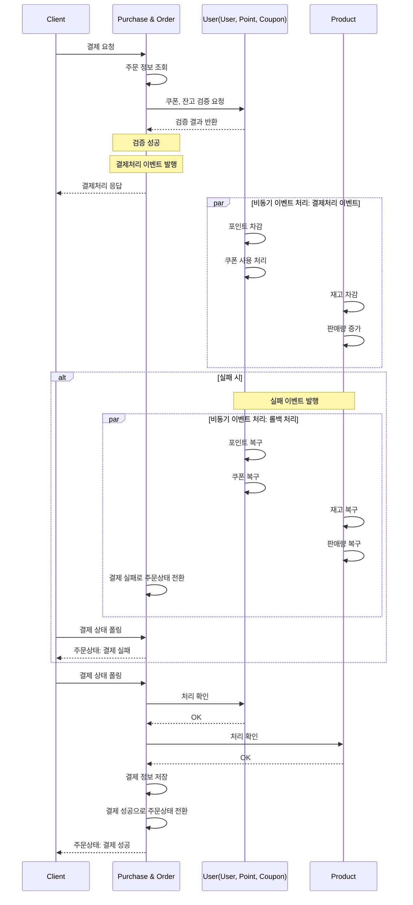

# MSA를 위한 도메인 분리와 결제 유즈케이스에 대한 분석

## 1. MSA
- 서비스의 규모가 커지고 단일 서비스로 트래픽을 처리할 수 없는 한계에 도달하면 도메인별로 서버와 DB를 분산하는 MSA 도입이 필요해질 수 있다.
- MSA 도입 시 병목이나 트래픽이 몰리는 서비스에 리소스를 집중할 수 있고, 각 서비스에 특화된 기술을 사용하기 쉬워져 대규모 트래픽 처리가 가능해진다.
- 장애상황에서도 영향 전파가 격리되고, 문제를 빠르게 판단, 해결, 재배포하기 좋아진다.
- 업무적 관점에서도 담당하고있는 마이크로서비스에 집중해서 개발할 수 있어서 편리하고 생산성이 증대될 가능성이 있다.

## 2. MSA 도입 시 도메인 분리
- 기존 서비스에서 나누었던 도메인 별로 각각 마이크로서비스를 구성하는 것도 가능하지만, 유사한 관심사나 책임을 가지는 도메인들 간에는 상호간에 자주 참조를 하는 등 도메인상 지역성이 존재할 것이라고 판단하여 몇몇 도메인은 묶은 채로 분리하는 것이 효율적일 것이라 생각했다.
1) 먼저 주문과 결제는 상품, 쿠폰 등을 담은 복합적인 도메인이며 결제 또한 Order를 결제행위의 단위로 보고있기 떄문에 유사한 도메인으로 보아 하나의 서비스로 구성할 수 있을 것이다.
2) User 도메인은 회원정보, Point는 잔액, Coupon은 쿠폰이라는 각각의 관심사가 있지만 모두 유저가 지니고 사용할 수 있는 것이기 때문에 하나의 서비스에서 처리하는 것이 자연스럽다.
3) Product 도메인은 위 두 서비스 단위와는 구분되는 독립적인 관심사를 가지고 있다고 생각되고, 독립적인 조회가 빈번히 일어날 것이므로 스케일아웃을 고려했을 때에도 별도의 서비스로 분리하는 것이 효율적일 것이다.
- 이렇게 각각의 서비스들이 독립적인 서비스로서 각자 서버와 DB를 운용한다면 대규모 트래픽에 더 적절하게 대응이 가능하다. 하지만 MSA 도임에도 한계점이 존재한다.

## 3. MSA의 한계
- 하나의 서비스에서 여러 마이크로 서비스로 나뉘었을 때 생기는 한계점으로 크게 두가지가 있을 수 있다.
1) 분리 환경이기 때문에 서비스간 트랜잭션 컨텍스트나 스레드 컨텍스트가 이어지지 못한다.
2) 네트워크로만 소통이 가능하기 때문에 속도 저하가 발생할 수 있다.
- 이 때문에 DB에 락을 걸고 여러 서비스간 동작을 하는 것이 불가능하고, 다른 서비스의 작업이 실패했을 때 곧바로 원래 서비스의 작업도 실패처리할 수 없으며, 심지어 네트워크 상의 이유 등으로 다른 서비스의 작업이 성공했는지 여부를 100% 확신할 수 없는 상황도 발생할 수 있다.
- 적은 트래픽의 경우에 반대로 기본적인 유지비용이나 응답속도에서 불리할 수도 있다.

## 4. 해결방안
1) 컨텍스트의 단절은 공통으로 이용할 수 있는 채널을 만든다.
   - 서비스간에 락이 필요하면 redis 등을 통해 분산락을 도입한다.
   - 비동기 CUD작업은 이벤트 기반으로 전환하고 kafka와 같은 외부 이벤트 브로커를 사용한다.
   - 트랜잭션 롤백은 어떤 서비스에서 작업 중에 실패할 경우 롤백 이벤트를 발생시켜 보상작업을 실행하게 하는 SAGA패턴을 적용한다.
2) 네트워크로 인한 응답 속도 지연은 네트워크보다 빠른 도구나 전략을 사용한다.
   - 대표적으로 캐싱 전략을 사용하면 캐시 히트 시 네트워크를 타지 않고 조회가 가능하다.
- MSA 도입 및 결제 유즈케이스에서 SAGA 패턴 적용
