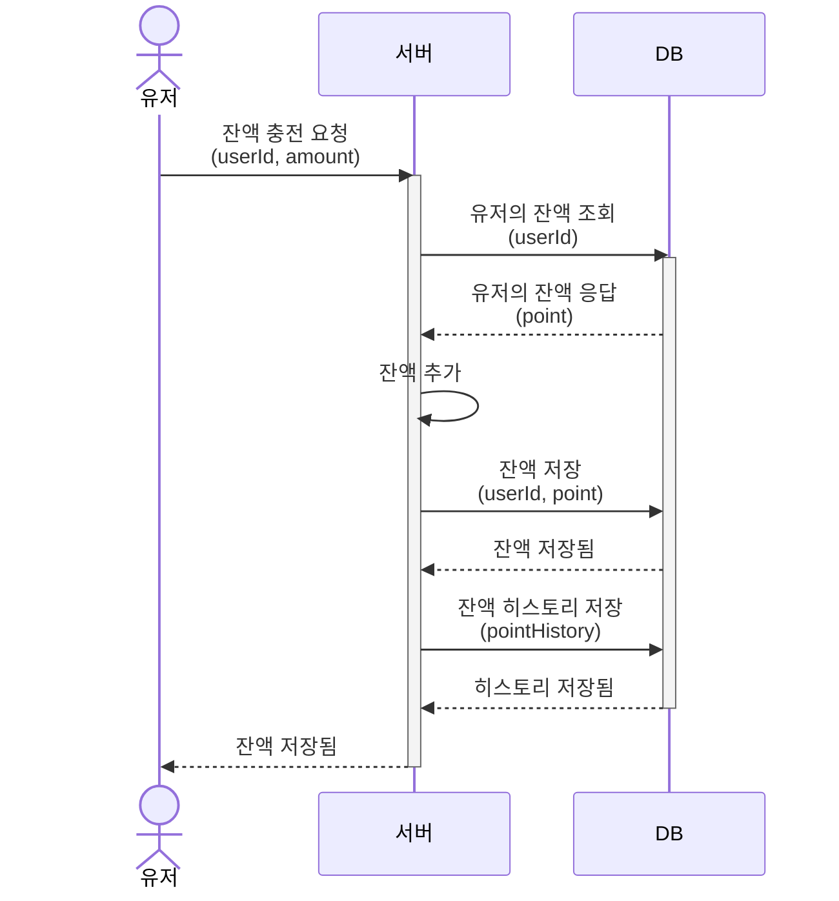

```mermaid
sequenceDiagram
actor User as 유저
participant Server as 서버
participant DB as DB

User->>Server: 잔액 충전 요청<br/>(userId, amount)
activate Server

Server->>DB: 유저의 잔액 조회<br/>(userId)
activate DB
DB-->>Server: 유저의 잔액 응답<br/>(point)
Server->>Server: 잔액 추가
Server->>DB: 잔액 저장<br/>(userId, point)
DB-->>Server: 잔액 저장됨
Server->>DB: 잔액 히스토리 저장<br/>(pointHistory)
DB-->>Server: 히스토리 저장됨
deactivate DB

Server-->>User: 잔액 저장됨
deactivate Server
```
