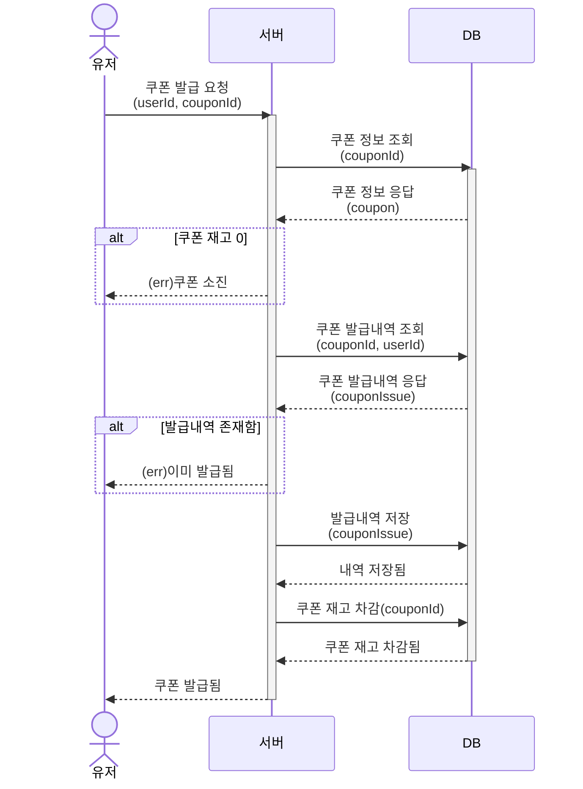

```mermaid
sequenceDiagram
actor User as 유저
participant Server as 서버
participant DB as DB

User->>Server: 쿠폰 발급 요청<br/>(userId, couponId)
activate Server

Server->>DB: 쿠폰 정보 조회<br/>(couponId)
activate DB
DB-->>Server: 쿠폰 정보 응답<br/>(coupon)

alt 쿠폰 재고 0
Server-->>User: (err)쿠폰 소진
end

Server->>DB: 쿠폰 발급내역 조회<br/>(couponId, userId)
DB-->>Server: 쿠폰 발급내역 응답<br/>(couponIssue)

alt 발급내역 존재함
Server-->>User: (err)이미 발급됨
end

Server->>DB: 발급내역 저장<br/>(couponIssue)
DB-->>Server: 내역 저장됨
Server->>DB: 쿠폰 재고 차감(couponId)
DB-->>Server: 쿠폰 재고 차감됨
deactivate DB

Server-->>User: 쿠폰 발급됨
deactivate Server
```
