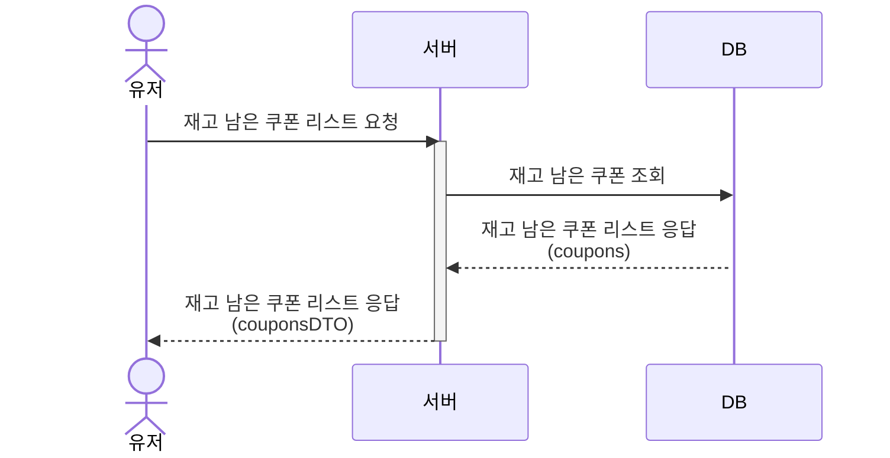

```mermaid
sequenceDiagram
actor User as 유저
participant Server as 서버
participant DB as DB

User->>Server: 재고 남은 쿠폰 리스트 요청
activate Server

Server->>DB: 재고 남은 쿠폰 조회
activate DB
DB-->>Server: 재고 남은 쿠폰 리스트 응답<br/>(coupons)

Server-->>User: 재고 남은 쿠폰 리스트 응답<br/>(couponsDTO)
deactivate Server
```
