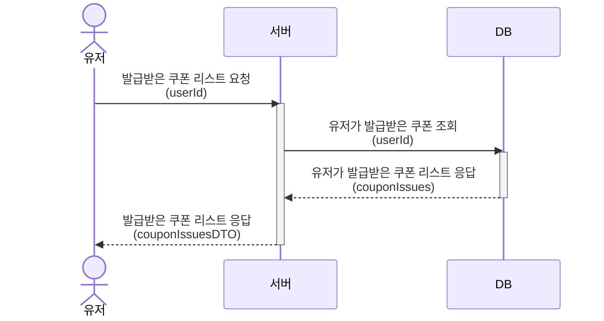

```mermaid
sequenceDiagram
actor User as 유저
participant Server as 서버
participant DB as DB

User->>Server: 발급받은 쿠폰 리스트 요청<br/>(userId)
activate Server

Server->>DB: 유저가 발급받은 쿠폰 조회<br/>(userId)
activate DB
DB-->>Server: 유저가 발급받은 쿠폰 리스트 응답<br/>(couponIssues)
deactivate DB

Server-->>User: 발급받은 쿠폰 리스트 응답<br/>(couponIssuesDTO)
deactivate Server
```
