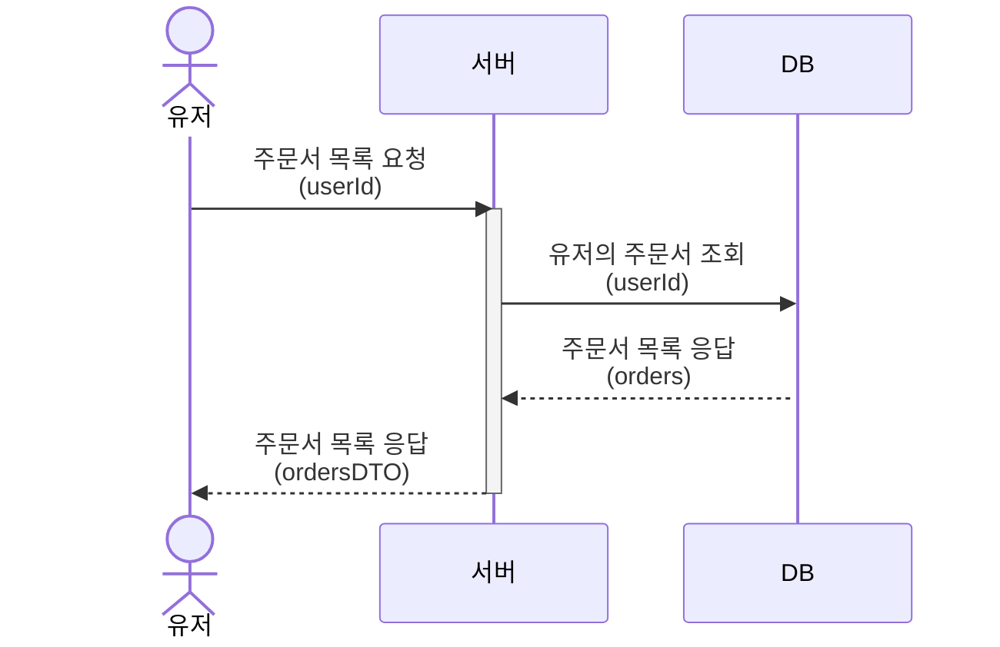

```mermaid
sequenceDiagram
actor User as 유저
participant Server as 서버
participant DB as DB

User->>Server: 주문서 목록 요청<br/>(userId)
activate Server

Server->>DB: 유저의 주문서 조회<br/>(userId)
activate DB
DB-->>Server: 주문서 목록 응답<br/>(orders)

Server-->>User: 주문서 목록 응답<br/>(ordersDTO)
deactivate Server
```
