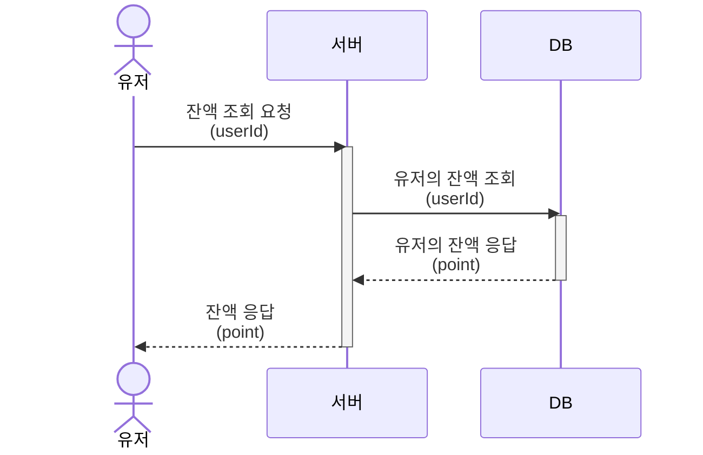

```mermaid
sequenceDiagram
actor User as 유저
participant Server as 서버
participant DB as DB

User->>Server: 잔액 조회 요청<br/>(userId)
activate Server

Server->>DB: 유저의 잔액 조회<br/>(userId)
activate DB
DB-->>Server: 유저의 잔액 응답<br/>(point)
deactivate DB

Server-->>User: 잔액 응답<br/>(point)
deactivate Server
```
