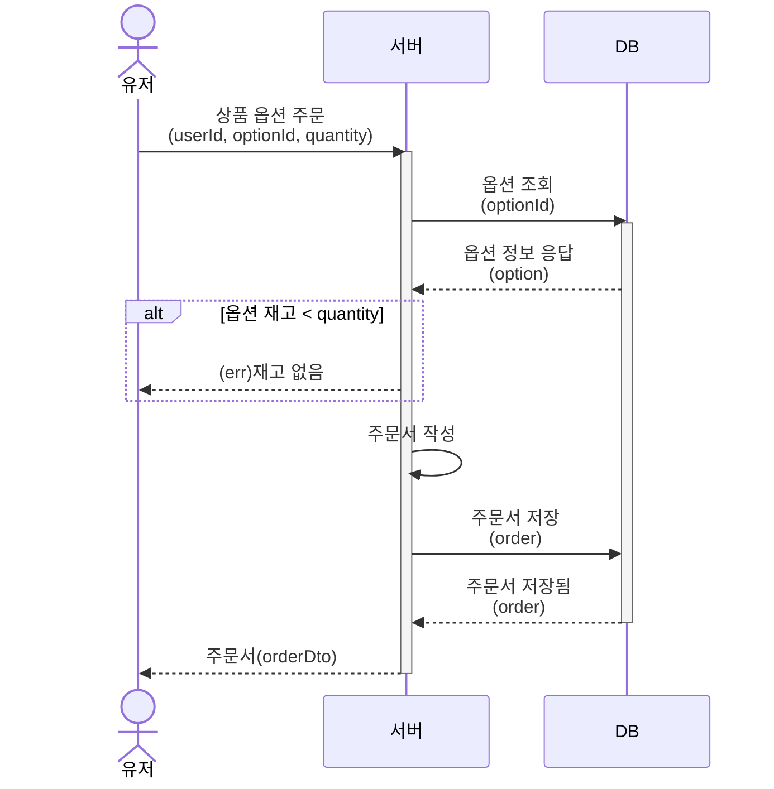

```mermaid
sequenceDiagram
actor User as 유저
participant Server as 서버
participant DB as DB

User->>Server: 상품 옵션 주문<br/>(userId, optionId, quantity)
activate Server

Server->>DB: 옵션 조회<br/>(optionId)
activate DB
DB-->>Server: 옵션 정보 응답<br/>(option)

alt 옵션 재고 < quantity
Server-->>User: (err)재고 없음
end

Server->>Server: 주문서 작성
Server->>DB: 주문서 저장<br/>(order)
DB-->>Server: 주문서 저장됨<br/>(order)
deactivate DB

Server-->>User: 주문서(orderDto)
deactivate Server
```
