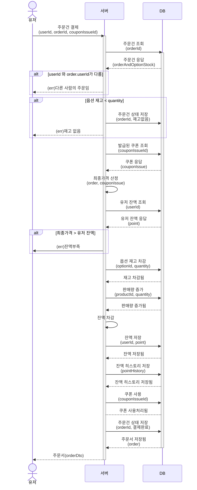

```mermaid
sequenceDiagram
actor User as 유저
participant Server as 서버
participant DB as DB

User->>Server: 주문건 결제<br/>(userId, orderId, couponIssueId)
activate Server

Server->>DB: 주문건 조회<br/>(orderId)
activate DB
DB-->>Server: 주문건 응답<br/>(orderAndOptionStock)

alt userId 와 order.userId가 다름
Server-->>User: (err)다른 사람의 주문임
end

alt 옵션 재고 < quantity
Server->>DB: 주문건 상태 저장<br/>(orderId, 재고없음)
Server-->>User: (err)재고 없음
end

Server->>DB: 발급된 쿠폰 조회<br/>(couponIssueId)
DB-->>Server: 쿠폰 응답<br/>(couponIssue)
Server->>Server: 최종가격 산정<br/>(order, couponIssue)
Server->>DB: 유저 잔액 조회<br/>(userId)
DB-->>Server: 유저 잔액 응답<br/>(point)

alt 최종가격 > 유저 잔액
Server->>User: (err)잔액부족
end

Server->>DB: 옵션 재고 차감<br/>(optionId, quantity)
DB-->>Server: 재고 차감됨
Server->>DB: 판매량 증가<br/>(productId, quantity)
DB-->>Server: 판매량 증가됨

Server->>Server: 잔액 차감
Server->>DB: 잔액 저장<br/>(userId, point)
DB-->>Server: 잔액 저장됨
Server->>DB: 잔액 히스토리 저장<br/>(pointHistory)
DB-->>Server: 잔액 히스토리 저장됨

Server->>DB: 쿠폰 사용<br/>(couponIssueId)
DB-->Server: 쿠폰 사용처리됨

Server->>DB: 주문건 상태 저장<br/>(orderId, 결제완료)
DB-->>Server: 주문서 저장됨<br/>(order)
deactivate DB

Server-->>User: 주문서(orderDto)
deactivate Server
```
